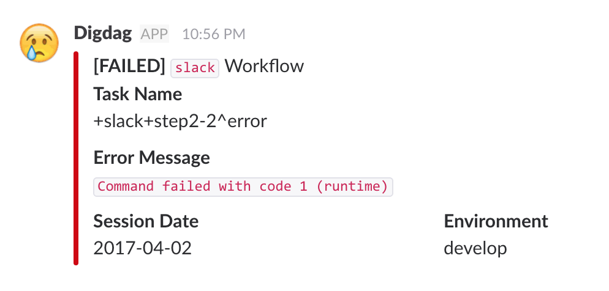

# digdag-slack
[](https://jitpack.io/#szyn/digdag-slack)
[](https://jitpack.io/#szyn/digdag-slack)

## Description
digdag-slack is a plugin sending messages to slack.  
It can use yaml templates for building messages.

***DEMO:***  

|SUCCESS|FAILED|
|---|---|
|[](sample/imgs/sample-good.png)|[](sample/imgs/sample-danger.png)|


## Features

- Can use the `slack>` opetaror
- Easy to use
- Flexible templates

## Requirement

- [Digdag](https://www.digdag.io/)


[Note]
If you want to use `task_name` variable, you must use digdag v0.9.9 and up.

## Usage
Also, you can see expamle workflow at [sample](https://github.com/szyn/digdag-slack/tree/master/sample) directory.

1. Create workflow file (e.g. slack.dig)

  ```yaml
  _export:
    plugin:
      repositories:
        - https://jitpack.io
      dependencies:
        - com.github.szyn:digdag-slack:0.1.1
    # Set Reqired params
    webhook_url: https://hooks.slack.com/services/XXX/XXX/XXX
    # Set Option params
    workflow_name: slack
    ENV: develop

  +step1-1:
    echo>: "Next will be success!"

  +step1-2:
    slack>: good-template.yml
  ```

2. Create templates for slack's payload (e.g. good-template.yml)

  ```yaml
  ---
  username: Digdag
  icon_emoji: ':blush:'
  attachments:
  - fallback: '[SUCCESS] ${workflow_name} workflow'
    color: "good"
    text: '*[SUCCESS]* `${workflow_name}` Workflow'
    mrkdwn_in:
    - text
    - pretext
    - fields
    fields:
    - title: Task Name
      value: "${task_name}"
      short: false
    - title: Session Date
      value: "${session_date}"
      short: true
    - title: Environment
      value: "${ENV}" # You can use environment values
      short: true
  ```

3. Runs workflow
  ```console
  $ digdag run -a slack.dig
  ```

## Author

[szyn](https://twitter.com/i_szyn)

## License

[Apache License 2.0](LICENSE)
